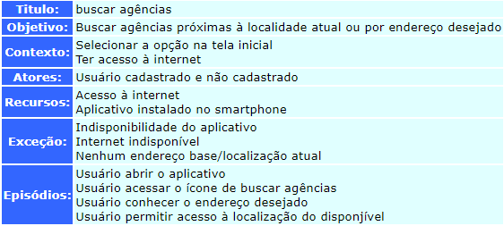
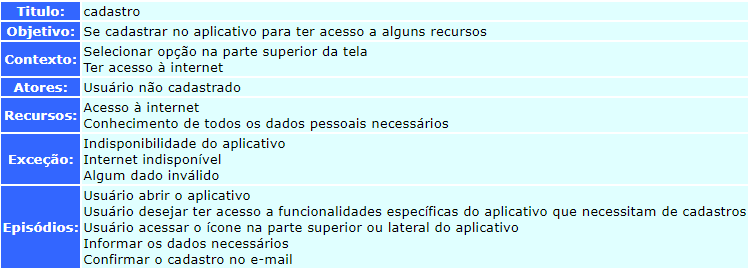
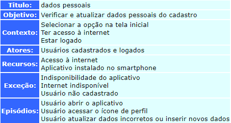
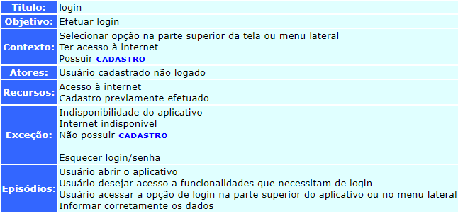
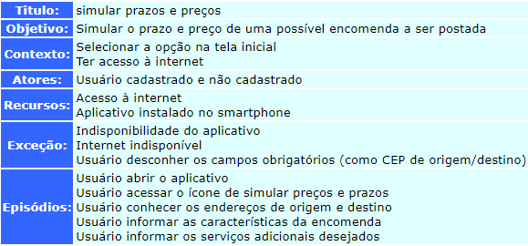

# Cenários v0.1
Cenários são exemplos reais de como um sistema pode ser usado;  
Eles devem incluir :  
- Uma descrição da situação inicial;  
- Uma descrição do fluxo normal de eventos;  
- Uma descrição do que pode dar errado;  
- Informação sobre outras atividades concorrentes;  
- Uma descrição do estado quando o cenário termina.  

- - -

## C&L
C&L foi a ferramenta utilizada para desenvolver o Léxicos encontrados no app dos Correios.	
O C&L:
Foi inicialmente desenvolvido como um trabalho acadêmico e hoje evolui para um projeto de Software Livre. Sua responsabilidade é do Grupo de Engenharia de Requisitos, da Puc-Rio.

O objetivo desse projeto é estudar e analisar técnicas de evolução de software através de um experimento prático. 

A aplicação utilizada como projeto inicial a ser 'evoluído' foi uma ferramenta de Edição de Cenários e Léxico disponibilizada em http://springfield.genesis.puc-rio.br:81/~pes/.

<a href= "http://pes.inf.puc-rio.br/cel/index_old.htm" target="blank"> Página da ferramenta </a>

- - -

## Cenários desenvolvidos
Foi seguido o padrão da ferramenta. Em breve serão ajustadas para tabela.

**Resumo:**  

| Tipo   | Quantidade              |
| ------ | ----------------------- |
| Total  | 10                      |

#### Cenário 01 - C01  
  

#### Cenário 02 - C02  
  

#### Cenário 03 - C03  
  

#### Cenário 04 - C04  
  

#### Cenário 05 - C05  
  

#### Cenário 06 - C06  
  

#### Cenário 07 - C07  
  

#### Cenário 08 - C08  
  

#### Cenário 09 - C09  
  

#### Cenário 10 - C10  
  

- - -

# Histórico

| Data     | Versão | Descrição                                               | Autor(es)           |
| -------- | ------ | ------------------------------------------------------- | ------------------- |
| 08/10/20 | 0.1    | Criação da página e adição dos cenários desenvolvidos no C&L  | Nícalo Ribeiro |