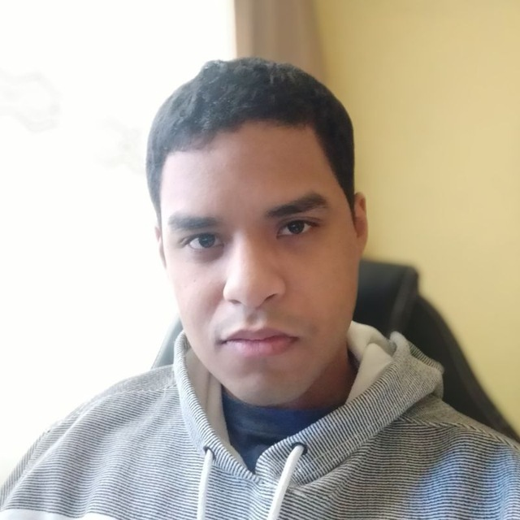

# Correios

- - -  

## Sobre
Respositório da disciplina **Requisitos de Software**, com o objetivo de levantar os requisitos funcionais e não funcionais do aplicativo dos **Correios** (*[PlayStore](https://play.google.com/store/apps/details?id=br.com.correios.preatendimento&hl=pt_BR)*, *[AppStore](https://apps.apple.com/br/app/correios/id1399617917#?platform=iphone)*), assim como levantar a pré-rastreablidade, elicitação, modelagem, análise e pós-rastreabilidade e outros artefatos necessários para a disciplina.
- - -
## Sobre o aplicativo dos Correios
Com o objetivo de fornecer soluções acessíveis, confiáveis e cada vez mais adaptadas ao perfil dos consumidores, os Correios aprimoraram a interface de seu aplicativo que oferece as seguintes facilidades:

• Realizar a Pré-Postagem de sua encomenda, obtendo o número de identificação que deverá ser apresentado em qualquer agência dos Correios, onde será finalizado o atendimento;  
• Buscar as agências mais próximas de sua localização em um raio de até 10 km;  
• Simular preços e prazos para cada tipo de postagem;  
• Incluir e salvar dados dos objetos informando o código de rastreamento;  
• Visualizar a data prevista da entrega de sua encomenda;  
• Acompanhar o rastreamento de seu objeto através de recebimento de notificação;  
• Acessar o serviço de Minhas Mensagens por meio da qual os Usuários (Destinatários) poderão consultar suas mensagens de caráter formal/oficial, enviadas por Emissores (Remetentes);  

- - -
## Contribuidores
Matrícula | Nome | E-mail | Git | 
--------- | ---- | ------ | --- |
180062026| Alan Marques Sousa | alan.sousa@prontonmail.com | alan-ms|
180119818| Felipe Boccardi Silva Agustini | felipeb.agustini@gmail.com | Fealps |
170144259 | Gustavo Nogueira Rodrigues| gustavonr.13@gmail.com | Gustavo-Nogueira |
160016169 | Nicalo Ribeiro Dourado Araujo| nicalo63@gmail.com | nicaloribeiro |
||Flavio Vieira Leao | | flaviovl|

- - -

