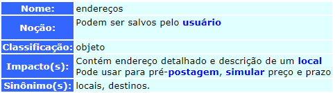
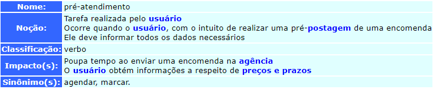

# Léxicos v1

- - -
> Essa é a **primeira** versão dos Léxicos  
> A segunda pode ser encontrada aqui: [Léxicos v2](./lexicos-v2.md)
## Introdução

Atividade que visa elaborar modelos capazes de representar características ou comportamentos de um software.  
**LAL - Léxico Ampliado da Linguagem -** Trata-se de uma técnica que compõe os cenários de forma a descrever os símbolos de uma linguagem. Nesse caso, essa técnica descreve alguns termos relacionados ao software em questão. Cada símbolo tem um nome, uma noção e um impacto, sendo que:  
**noção** : é o que significa o símbolo (denotação);  
**impacto** : é o efeito do símbolo na aplicação ou o efeito de algo na aplicação sobre o símbolo (conotação).  

Símbolos também possuem uma classificação, que pode ser :   

- **estado**;  
- **verbo**;  
- **objeto**;  
- **sujeito**.   

- - -

## C&L
C&L foi a ferramenta utilizada para desenvolver os léxicos encontrados no app dos Correios.	
O C&L:
Foi inicialmente desenvolvido como um trabalho acadêmico e hoje evolui para um projeto de Software Livre. Sua responsabilidade é do Grupo de Engenharia de Requisitos, da Puc-Rio.

O objetivo desse projeto é estudar e analisar técnicas de evolução de software através de um experimento prático. 

A aplicação utilizada como projeto inicial a ser 'evoluído' foi uma ferramenta de Edição de Cenários e Léxico disponibilizada em http://springfield.genesis.puc-rio.br:81/~pes/.

<a href= "http://pes.inf.puc-rio.br/cel/index_old.htm" target="blank"> Página da ferramenta </a>

- - -

## Léxicos Desenvolvidos
Foi seguido o padrão da ferramenta. Em breve serão ajustadas para tabela.

**Resumo:**  

| Tipo   | Quantidade              |
| ------ | ----------------------- |
| Objeto | 05                      |
| Verbo  | 06                      |
| Estado | 03                      |
| Total  | 14                      |

#### Léxico 01 - L01  
  

#### Léxico 02 - L02  
  

#### Léxico 03 - L03  
  

#### Léxico 04 - L04  
  

#### Léxico 05 - L05  
  

#### Léxico 06 - L06  
  

#### Léxico 07 - L07  
  

#### Léxico 08 - L08  
  

#### Léxico 09 - L09  
  

#### Léxico 10 - L10  
  

#### Léxico 11 - L11  
  

#### Léxico 12 - L12  
  

#### Léxico 13 - L13  
  

#### Léxico 14 - L14  
  

- - -

## Controle de versão

| Data     | Versão | Descrição                                               | Autor(es)           |
| -------- | ------ | ------------------------------------------------------- | ------------------- |
| 08/10/20 | 0.1    | Criação da página e adição dos léxicos desenvolvidos no C&L  | Nícalo Ribeiro |
| 09/10/20 | 0.2    | Revisão da página  | Gustavo Nogueira |